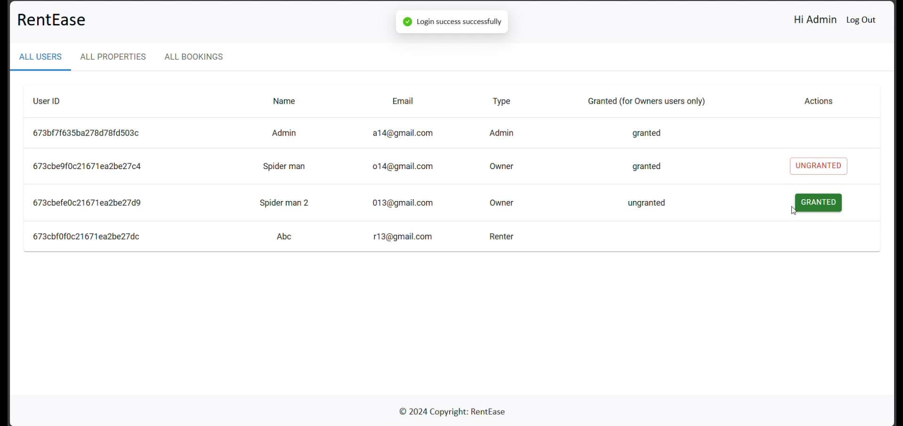

# House Rent App

A MERN (MongoDB, Express.js, React.js, Node.js) web application designed to facilitate the process of searching, inquiring, and renting properties. This app includes user roles for renters and owners, property management features, and admin oversight to ensure a safe and secure platform.

---

## Table of Contents

- [Features](#features)
- [System Requirements](#system-requirements)
- [Project Architecture](#project-architecture)
- [Installation and Setup](#installation-and-setup)
- [Environment Variables](#environment-variables)
- [Usage](#usage)
- [Folder Structure](#folder-structure)
- [Contributing](#contributing)
- [Project Implementation & Execution](#project-implementation--execution)

---

## Features

- **User Registration & Authentication**: Supports two roles: Renter and Owner.
- **Property Listings**: Allows owners to add, update, and delete property listings.
- **Property Search & Filters**: Renters can browse listings using filters like location, rent range, and property type.
- **Booking System**: Renters can inquire about properties, and owners can confirm bookings.
- **Admin Role**: Admin reviews and approves owner registrations, manages platform governance, and monitors activity.
- **Real-Time Status Updates**: Booking and property status changes are displayed instantly to users.

---

## System Requirements

- **Hardware**: Windows 8 or higher machine with a stable internet connection (30 Mbps recommended).
- **Software**: Node.js, MongoDB, two web browsers (for testing).

---

## Project Architecture

This project follows a client-server architecture:

- **Frontend**: Built with React and styled using Bootstrap, Material UI, and Ant Design for a responsive UI.
- **Backend**: Developed with Express.js, connected to MongoDB for data storage.
- **Database**: MongoDB manages user accounts, property listings, and booking information.

---

## Installation and Setup

### Prerequisites

1. **Node.js & npm**: Install [Node.js](https://nodejs.org/en/download/).
2. **MongoDB**: Install [MongoDB](https://www.mongodb.com/try/download/community).

### Step-by-Step Guide

1. **Clone the Repository**:
   ```bash
   git clone https://github.com/your-username/house-rent-app.git
   cd house-rent-app
   ```

2. **Backend Setup**:
   - Navigate to the backend folder:
     ```bash
     cd backend
     ```
   - Install dependencies:
     ```bash
     npm install
     ```
   - Create an `.env` file in the `backend` directory (see Environment Variables section below).
   - Start the backend server:
     ```bash
     npm start
     ```

3. **Frontend Setup**:
   - Open a new terminal and navigate to the frontend folder:
     ```bash
     cd frontend
     ```
   - Install dependencies:
     ```bash
     npm install
     ```
   - Start the frontend server:
     ```bash
     npm start
     ```

4. **Access the App**:
   - Open your browser and go to `http://localhost:3000` for the frontend and `http://localhost:8000` for the backend.

---

## Environment Variables

Create an `.env` file in the `backend` directory and configure the following environment variables:

```plaintext
PORT=8000
MONGO_URI=your_mongodb_connection_string
JWT_KEY= cVjH7n6M4pZ1jK2dN8oX1bXrQw2+Jk8Gx5zS1R3iZ+fVjFcQ0AhVFnQYmK5e25a
```

- **PORT**: Port number for backend server (default is 8000).
- **MONGO_URI**: MongoDB connection string.
- **JWT_KEY**: Secret key for JSON Web Token (JWT) authentication.

---

## Usage

### Roles and Functionality

1. **Renter**: Registers, browses properties, sends inquiries, and views booking status.
2. **Owner**: Registers and awaits admin approval, manages property listings, and handles booking requests.
3. **Admin**: Approves owners, manages user activity, enforces platform policies.

### Typical User Flow

- Renter registers/logs in, browses properties, inquires about a property, and receives confirmation if approved.
- Owner registers/logs in, adds properties, manages bookings.
- Admin monitors activities, approves legitimate owner accounts, and enforces policies.

---

## Folder Structure

```plaintext
house-rent-app/
│
├── frontend/                 # React frontend
│   ├── src/
│   └── public/
│
├── backend/                  # Express backend
│   ├── config/               # Database and environment configuration
│   ├── controllers/          # Route controllers
│   ├── models/               # MongoDB models
│   ├── routes/               # API route definitions
│   └── middleware/           # Authentication and validation
│
└── README.md
```

---

## Contributing

Contributions are welcome! Please follow these steps:

1. Fork this repository.
2. Create a new branch (`git checkout -b feature-branch`).
3. Make your changes and commit (`git commit -am 'Add new feature'`).
4. Push to the branch (`git push origin feature-branch`).
5. Open a Pull Request.

---
## Project Implementation & Execution

Once development is complete, the application is tested to ensure all features are functional and bug-free. The following are screenshots of the key components of the app:

- **Landing Page**:
  
  

- **Login and Register Page**:
  
  

- **Admin Panel**:
  

- **Owner Panel**:
  

- **Tenant Panel**:
  
---

